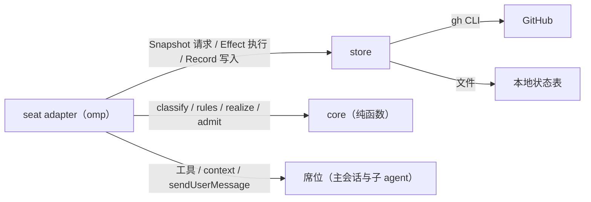

# omp-roundtable 系统设计

## 0 定位

- **层级与元素**：L1 系统上下文。系统只有一个 container：在 omp 进程内运行的插件。按 C4 规则本文同时承担 L1 与 L2，直接分解到 component。
- **读者与审批者**：读者是插件的实现者和维护者；审批者是操作员 Mouriya-Emma。
- **要决定的事**：怎样让多个 agent 按「逐个交付 GitHub issue」的协议协作，而协议不依赖任何 agent 的上下文记忆。
- **本文决定**：领域与需求、核心抽象（事实、票据、席位、回复）、component 划分、component 之间的契约、端到端走查和评估。
- **不在本文决定**：
  - 协议规则的全集、票据目录和状态空间的穷举方式，归 [core.md](core.md)。
  - 记录的编码细节、gh 与本地后端的实现，归 store 的实现。
  - omp 钩子的使用细节，归 seat adapter 的实现。
  - 单个 issue 的写法和 review 的门禁内容，归 `writing-issue`、`writing-pr`、`review-pr` 等 skill，本系统只把它们当作席位工作时要读的材料。
- **非目标**：
  - 同一份议程由多个 omp 进程并发推进。
  - 防御同一 GitHub 凭据持有者的恶意改写。
  - 替代 omp 原生的 spawn、消息和等待机制。
  - 在 GitHub 以外的代码托管平台运行。

## 1 问题域

### 域与固有性质

| 域 | 固有性质 | 证据 |
|---|---|---|
| LLM agent（omp 会话） | 上下文会被 compact，compact 后不保证记得协议；输出是可能出错的主张；同一进程内的子 agent 共享插件模块 | omp 18.4.2 源码：`task/executor.ts` 在进程内运行子 agent；`ctx.agent` 暴露 `{kind,id,name,depth,parentId}` |
| omp 宿主 | 插件工具对所有席位可见；`context` 钩子在每次模型请求前执行；`tool_call` 钩子能拦截 `yield`；`sendUserMessage` 能在存活会话里启动一轮对话，对 parked 或 aborted 会话无效；插件不能自己 spawn 原生子 agent | 附件 [域证据](omp-roundtable.evidence.md) |
| GitHub | issue、PR、HEAD、合并、评论都在 GitHub 上，并由它维护；所有 agent 共用同一个账号，看作者分不出是谁写的；`mergeable` 可能是 `UNKNOWN`；合并支持 `--match-head-commit`；渲染 Markdown 时隐藏 HTML 注释 | GitHub REST/GraphQL 文档、`gh pr merge --help` |
| 操作员 | 发起一轮交付，决定推进顺序；不在交付过程中被询问 | delivering-issues skill「不停顿」一节 |

### 共享现象

| 方向 | 现象 |
|---|---|
| 席位 → 系统 | 调用端口工具提交回复；调用 `yield` 结束自身；会话开始、compact、结束 |
| 系统 → 席位 | 当前持有的票据（随每次请求注入）；变更通知；拦截 `yield` 时给出的理由 |
| 系统 ↔ GitHub | 读 issue、PR、记录；写评论（可读正文加隐藏的带签状态）、创建和关闭 issue、合并 PR |
| 主会话 → 系统 | 发起议程并给出顺序；按席位请求调用原生 `task` |

### 需求

- **现有行为**（来自 delivering-issues skill；除 R4 的授权方式按 R20 改变外，全部保留）：
  - R1：议程严格串行，前一项到达终点之前不开始下一项。
  - R2：每个 issue 由一名隔离的 `task:high` owner 独占实现。
  - R3：每轮 review 和每次验收都由一名全新的 `task:mid` 完成，并钉住一个 HEAD。
  - R4：合并的前提是 review 与验收两个结论都对当前输入有效，并且 PR 可合并、checks 通过、恰好关闭当前 issue。
  - R5：合并之后在合并提交上再验收一次；不通过就开修正 issue，修正 issue 作为当前项的一部分一起交付。
  - R6：契约问题由主会话裁定，设计文档只由主会话修改。
  - R7：有 parent 时，最后一项完成后做树关闭验收。
  - R8：不向操作员提问。
- **新增**（操作员方向，2026-09-28）：
  - R9：协议放在插件代码里，不放在任何 agent 的上下文里。
  - R10：所有参与者是平等的席位，主会话也是其中一个。
  - R11：所有事实都存在存储里。有 gh 时存在 GitHub 上，没有 gh 时存在本地状态表。
  - R12：agent 不自己写 GitHub（不评论、不编辑、不关闭、不合并），只把回复交给圆桌；回复本身携带状态，由程序写进存储。读取 GitHub 不受限制。
  - R13：投递出去不算消费，席位显式回复才算；席位忘了回复就想结束自身时，要被拦下并告诉它必须先回复。
  - R14：原生机制优先。插件做不到、只能靠工具调用完成的事，由主会话代为调用。
  - R15：机器可读的状态要带 HMAC 签章，而且不显示在正文里。
  - R20：状态明确时程序直接推进，主会话只收到通知。合并由程序在 R4 的条件成立时执行，不再需要主会话另发授权。
- **从域性质推出**：
  - R16：因为会失忆，票据必须能随时完整地重新投递。
  - R17：因为输出只是主张，只有写进存储、签章有效并且与票据钉住的输入一致的回复才算数。
  - R18：因为 GitHub 写入可能成功了但没收到响应，写入必须能先查源头再决定要不要写，不盲目重试。
  - R19：因为 `mergeable` 可能未知，推导要把「未知」当成一种独立的状态，而不是当成「否」。

## 2 驱动

### 质量场景

| # | 刺激源 | 刺激 | 制品 | 环境 | 响应 | 可观测指标 |
|---|---|---|---|---|---|---|
| Q1 | omp | 持票席位被 compact | seat adapter | 交付进行中 | 下一次模型请求里仍带着完整票据 | 抓取请求体，100% 含票据 |
| Q2 | 操作员 | omp 在一项交付中途重启 | 全系统 | 已有 PR 与 gate 记录 | 恢复后推导出的票据和重启前一致；没有重复的 GitHub 写入 | 重复记录数 = 0 |
| Q3 | 人类或 CI | gate 运行期间 PR 被推了新提交 | core | gate 进行中 | 旧 gate 票据被撤回，不会在旧结论上合并 | 陈旧合并 = 0 |
| Q4 | agent | 手写一条看起来像标记的评论 | store | 任意 | 推导忽略它 | 被当作事实的次数 = 0 |
| Q5 | agent | 没回复就调用 `yield` | seat adapter | 持有票据 | `yield` 被拦下，并告诉它要先回复 | 拦截率 100% |
| Q6 | 维护者 | 修改或新增一条规则 | core | 测试 | 穷举抽象状态空间：没有落在停滞白名单之外的非终点死角 | 测试失败即阻止合入 |
| Q7 | 系统 | 定时全量重算，加上事件触发的推导 | seat adapter 与 store | 10 个条目的议程交付进行中 | 在 GitHub API 配额内完成；定时间隔与每小时上限都可配置，默认 120 秒、每小时 1500 次调用（GitHub 认证配额为 5000 次） | 每小时实际调用数不超过配置上限 |

### 约束

| 来源 | 约束 | 排除了什么 |
|---|---|---|
| 技术 | 以 omp 插件形式运行（`package.json` 的 `omp.extensions`），只通过包路径导入宿主模块 | 用绝对路径导入宿主源码（那样会拿到另一份模块单例） |
| 技术 | 只用宿主公开或已有插件在用的能力：`registerTool`、`on(context/tool_call/agent_end/session_*)`、`sendUserMessage` | 调用 `runStructuredSubagent`、`IrcBus` 等宿主内部接口 |
| 组织 | GitHub 客户端就是 `gh` CLI，凭据取自 `gh auth` | 另外管理 token |
| 组织 | 独立仓库，在 omp-config 的 `install-plugins.sh` 里声明安装 | 放在 omp-config 里作为本地扩展 |

优先级：Q1、Q3、Q4、Q5 事关协议正确，最高；Q2 与 Q6 次之；Q7 最低。

## 3 模型

四个核心抽象，每个隐藏一个会变的决定。

- **事实（Fact）**：存储里的一切：issue、PR、记录、议程。它隐藏「状态放在哪里」这个决定（GitHub 还是本地）。推出自 R11、R17。
  - 不变量：每一轮推导都从存储的实时读数构造事实；系统不保存事实的副本。
- **票据（Ticket）**：从事实推导出来的席位身份，其中包含该席位要做的事。票据本身不是状态。它隐藏「协议规则」这个决定。推出自 R9、R16。
  - 不变量：同一组事实永远推导出同一组票据；票据自带执行所需的全部信息；票据钉住生成时的输入，这些输入与实时事实不一致时，就推导不出这张票据（相当于撤回）。
- **席位（Seat）**：持有票据的一个存活 agent 会话。它隐藏「由哪个 agent、以什么方式执行」这个决定。推出自 R2、R3、R10、R14。
  - 请求名由票据身份决定（core.md §3「席位名」）。omp 在名字重复时会追加 `-2` 等后缀，所以绑定就是：去掉后缀后按请求名在 agent registry 里查找，不在进程里另存。
  - 不变量：一张票据只对应一个请求名；gate 票据的请求名包含它钉住的输入和尝试序号，所以输入一变、或需要一次独立的新尝试时，就换一名新席位。
- **回复（Reply）**：席位对自己票据的唯一输出，同时也是回执。它隐藏「记录怎么编码」这个决定。推出自 R12、R13、R15、R17。
  - 不变量：回复经核验通过（席位名、载荷 schema、实时前提）后，才编码成一条带签评论写进存储。
  - 幂等键：能完结票据的回复用票据 id；中间型回复（提问）用 `(票据 id, 内容哈希)`。重发一条已写入的相同回复，得到的是「已写入」而不是拒绝。

**关系**：事实经推导得出票据；票据绑定到席位；席位提交回复；回复被写成新的事实。

**禁止的关系**：
- 席位之间为了协议事务互相通信。
- 席位直接写存储。
- 票据或绑定被当作事实使用。
- core 读取任何 IO。

术语：「推导」专指 core 的纯函数链 `classify → rules → realize`；core 把票据和效应统称为「义务」：席位持有的义务是票据，由程序自己执行的机械写入是效应。

替代方案（被否）：
- 带转移图的工作流：指针与现实会分叉，并且需要一个会失忆的调度者来维持。
- 本地事件日志作为权威：与 GitHub 构成两个事实来源。

详见 §6。

## 4 结构

### component

| component | 拥有 | 隐藏的决定 | 文档 |
|---|---|---|---|
| core | 协议规则与票据内容：`classify`、`rules`、`realize`、`admit`，以及各类票据的简报模板与结论 schema；唤醒或派出席位的票据也由它给出 | 规则表、守卫、有效性规则、停滞判据、简报内容 | [core.md](core.md) |
| store | 存储端口的两个后端（gh 与本地）、记录编解码与 HMAC、效应执行 | 事实放在哪里、记录的线上格式、签章密钥 | 由代码实现 |
| seat adapter | omp 端口工具、`context` 注入、`yield`/`agent_end` 回执拦截、投递、registry 读数、推导循环、召集与恢复 | 宿主 API 的使用方式 | 由代码实现 |

依赖方向：seat adapter 依赖 core 与 store；store 依赖 core 的类型；core 不依赖任何东西。所以 core 可以单独交付和测试，store 可以脱离 omp 用本地后端测试。

### component 之间的契约

类型定义放在 `src/core/types.ts`，下面只写语义。

- **C1 读数**（store 与 seat adapter → core）：存储读数 `Snapshot`，以及宿主观察 `host`。`host` 包括三项：registry 读数 `seats`、本进程内的效应执行结果 `execution`、策略原文 `policy`。内容见 core.md §1。
  - 读取失败时整次推导作废，不拿部分读数去推导；seat adapter 直接把读取失败告诉主会话。
  - `mergeable` 与 checks 可以取「未知」。
  - 签章无效的记录不进入 Snapshot，只计入诊断。
- **C2 Reply → Record**：
  1. seat adapter 把 `(调用者的 ctx.agent, 载荷)` 交给 `admit`，得到 `Record`、`Replayed` 或 `Rejected(reason)`。
  2. store 把 `Record` 写成一条带签评论：先按幂等键在源头查找，找到了就不再写。
  3. `Rejected` 的理由原样返回给席位。
- **C3 效应**（core → store）：
  - 种类见 core.md §3「效应」：创建、关闭并挂接议程 issue；依据最新的 `PrSubmit` 创建或更新 PR；依据草稿创建 issue；带基准哈希替换 issue 正文；通知受影响的 issue 与他人的 PR；关闭或重开 issue 与 parent；重跑 checks；合并 PR（带 `matchHead`）。
  - 议程只在召集时写一次，顺序由主会话在召集时决定。之后新增的条目来自 `Decision` 中带锚点的草稿与插入，议程由 core 从召集清单与这些记录计算得出。
  - 每个效应都靠标记或前提实现幂等：store 执行前先读源头，效果已经存在就视为完成；正文替换的基准哈希不符时，不写入。
  - 执行结果不回写到存储。成功与否作为宿主观察 `execution` 交给下一轮推导；失败由 core 转成主会话的 `decide(effectFailed)` 票据，不静默重试。
- **C4 票据**（core → seat adapter）：
  - 每张席位票据都带着请求名、席位请求（`task:high` 或 `task:mid`、`isolated: true`、请求名、简报）与简报。
  - registry 读数进入了 `classify`，所以「席位 parked 就用原生 `write agent://` 唤醒」「席位不在就用原生 `task` 派出」本身也是 core 给主会话的票据。adapter 只负责投递，不做任何判断。
- **C5 席位身份**（omp → seat adapter）：`ctx.agent` 与 registry 状态。它是宿主维护的事实，adapter 每轮只查询，不保存副本。

### 进程视图

所有 component 都在同一个 omp 进程里。seat adapter 的模块单例串行执行推导循环：一轮结束才开始下一轮。

触发推导的事件：
- 回复被写入；
- registry 状态变化，或效应执行失败；
- 主会话召集或恢复议程；
- 定时全量重算（兜底）。

每个席位会话各自绑定一份插件实例，投递用该席位自己会话的 `sendUserMessage`。席位在 parked 之后恢复时会重新绑定，所以 adapter 在新会话的 `session_start` 里刷新绑定。

**召集**：主会话在自己的端口上召集议程，给出有序的 issue 清单，以及每项的召集载荷（交付目标、是否仅设计、要接管的 PR）。召集有两种模式：
- `plan`：只推导并返回计划，不写存储；
- `execute`：写入议程记录，开始推导。

**恢复**：新会话要接手一份已有议程，前提是操作员确认原会话已经结束，主会话把这一确认作为恢复参数传入。没有这项确认时，adapter 拒绝恢复并报告所有权阻塞。本设计不跨进程探测存活状态。

**工作目录**：席位的工作目录由请求名推出（core.md §3）。续作 owner 与原 owner 的请求名相同，因此工作目录也相同，未推送的提交原地可见。

**简报中的策略原文**：简报模板要求附上策略原文。adapter 每轮推导时读取配置路径下的 `APPEND_SYSTEM.md`，并取主会话最近一次 `before_agent_start` 看到的系统提示区块，作为 `policy` 交给 `realize`，因此每次投递用的都是当时最新的原文。

**派出的前提**：主会话派出席位时，`task` 必须以异步方式执行，也就是宿主设置 `async.enabled` 为真（默认即为真），并且 agent 类型没有声明 `blocking: true`。否则主会话会同步等待子席位，子席位一提问就会死锁。seat adapter 在召集时检查这项设置，不满足就拒绝召集。

### 持久化与凭据

| 状态 | 写者 | 读者 |
|---|---|---|
| 议程记录、所有评论记录、issue 与 PR | store（gh 后端时由 GitHub 维护） | store |
| 本地状态表（没有 gh 时） | store | store |
| 席位绑定 | 不存储：按席位名向 omp registry 查询 | seat adapter |
| HMAC 密钥 | 首次运行时生成，存在 `~/.omp/agent/omp-roundtable/key`，权限 0600 | store |

没有 gh 时，本地状态表位于 `~/.omp/agent/omp-roundtable/state/`。

## 5 走查

主路径：一项需要写代码的 issue。以下每一步都由推导触发，不存在「上一步做完了所以做下一步」的连线。

1. 主会话发起议程：程序新建议程 issue，正文是有序列表；有 parent 就挂到 parent 下，然后立即关闭。
2. 推导：第一项是 open、没有可维护的 PR，得出 owner 的 deliver 票据。registry 里没有这个请求名的席位，于是主会话得到一张「派出席位」票据。
3. 主会话用原生 `task` 按席位请求派出 owner；owner 的 `ctx.agent.id` 去掉后缀后等于请求名，于是认领 deliver 票据。
4. owner 推送分支，然后把分支、head、标题和正文作为 `PrSubmit` 回复给圆桌。`admit` 核对远端 head，通过后写成记录；效应再依据它创建 PR。
5. 推导：PR 在 HEAD h 上，没有对当前输入有效的 gate 结论，于是同时得出 review 票据与 accept 票据，各自需要一名新席位。
6. reviewer 与验收者各自回复结论，写成两条记录。
7. 两个结论都通过、PR 可合并、checks 通过，推导得出合并效应（`matchHead = h`），由 store 执行。
8. 下一轮读到 PR 已合并、issue 已关闭，得出合并后验收票据；验收通过后，这一项到达终点。
9. 推导得出下一项的 deliver 票据。

失败与扩展路径（这里只写结论，全部走查见 core.md）：
- **gate 期间 PR 被推了新提交**：两个 gate 的钉住输入与实时不符，票据撤回；新 HEAD 上重新得出两张 gate 票据。
- **review 不通过**：主会话得到核实发现票据。有发现被维持（归 owner）时，owner 得到 fix 票据；全部被驳回时，这条结论被取代，重新得出 review 票据。
- **合并请求已发出但响应丢失**：下一轮读到 PR 已合并，合并效应的前提不再成立，因此不会重复合并。
- **席位没回复就调用 `yield`**：被拦下，理由中写明它持有的票据和回复方式。
- **owner 会话变为 parked**：主会话得到一张票据，用原生 `write agent://` 唤醒它。会话已经 aborted 时，主会话按同一个请求名派出续作 owner（registry 会加 `-2` 后缀），续作 owner 在同一个工作目录里接着做同一个 PR。

崩溃矩阵见附件 [崩溃矩阵](omp-roundtable.crash-matrix.md)。

## 6 评估

| 决定 | 替代方案 | 为什么不选替代方案 |
|---|---|---|
| 按状态推导票据 | 带转移图的工作流 | 指针会与 GitHub 分叉，需要对账；例外路径的边会爆炸；恢复要走单独的流程 |
| 事实只放在存储里 | 本地事件日志作为权威，GitHub 只作投影 | 两个事实来源；写入无法原子化；换机器后无法恢复 |
| 回复由程序代写，并带隐藏签章 | agent 自己调用 `gh` 发评论并提交 URL | 输入清单是自报的；伪造与误写无从分辨；agent 可能忘记 |
| 合并作为程序效应，条件成立即执行（R20） | 保留主会话的授权记录，程序凭授权合并 | R4 的条件都是可机读的事实，授权并不增加判断；多一张主会话票据只会拉长每一项的周期。主会话的判断保留在裁定发现与契约问题上，那些才是真正需要判断的地方 |
| 席位名由票据身份决定 | 在进程内保存席位与票据的绑定和历史 | 重启后绑定会丢失；gate 新鲜性要靠历史维护；续作的工作目录需要另外记录 |
| 一条回复只写一条评论，其余 GitHub 对象由效应生成 | 一条记录同时写 PR、issue 与评论 | 多次写入之间崩溃，会让幂等检查失效，造成重复创建或遗漏 |
| 独立插件仓库 | omp-config 本地扩展 | core 无法独立测试与发布 |

**风险**：
- 宿主私有行为随升级变化，例如 `ctx.agent` 字段、`context` 钩子的时机、registry 对同名重复派出的处理。缓解：seat adapter 的运行时验收在每次升级后重跑，其中包括「同名续作」这一项。
- 等待集合或 `stall` 白名单有遗漏，会让某项交付静默卡住。缓解：非终点且推导不出票据时，一律给主会话发 `stall` 票据；穷举测试断言 `stall` 只出现在列举过的异常情形里。

**敏感点**：
- 输入清单包含哪些字段：少了会在陈旧结论上合并，多了会让结论反复失效。issue 正文按整体哈希，任何人工改动都会让 gate 重跑；这是用多重跑一次换不漏检。

**权衡点**：
- 定时重算的间隔：影响 API 配额和对外部变化的反应速度。

**证伪条件**：
- 席位在 compact 后的请求里看不到票据。
- 手写的标记被当作事实。
- 在无效的 gate 结论上发生了合并。

以上任何一条出现，都说明对应的抽象设计有误。

## 7 维护

- 规则只在 core 里修改，并随同更新 core.md 与穷举测试。
- store 或 seat adapter 如果开始包含规则判断，说明元素边界被破坏，要把规则移回 core。
- omp 大版本升级后，重新核对附件中的域证据，并重跑 seat adapter 的运行时验收。
- delivering-issues skill 的协议由本系统取代。等 seat adapter 合入，并且 core 的简报模板已涵盖该 skill 的 briefs 内容之后，把 skill 正文替换为指向本插件的用法说明；在此之前保留 skill 原文。
