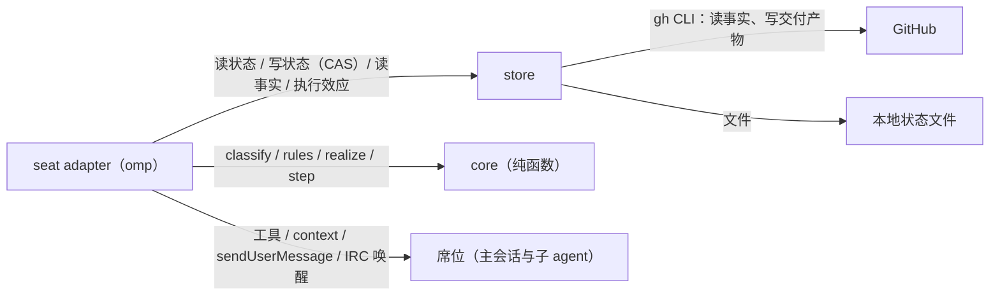

# omp-roundtable 系统设计

## 0 定位

- **层级与元素**：L1 系统上下文。系统只有一个 container：在 omp 进程内运行的插件。按 C4 规则本文同时承担 L1 与 L2，直接分解到 component。
- **读者与审批者**：读者是插件的实现者和维护者；审批者是操作员 Mouriya-Emma。
- **要决定的事**：怎样让多个 agent 按「逐个交付 GitHub issue」的协议协作，而协议不依赖任何 agent 的上下文记忆。
- **本文决定**：领域与需求、核心抽象（状态、GitHub 事实、票据、席位、回复）、component 划分、component 之间的契约、端到端走查和评估。
- **不在本文决定**：
  - 协议规则的全集、票据目录和状态空间的穷举方式，归 [core.md](core.md)。
  - 状态文件的格式、GitHub 查询的组织方式，归 store 的实现。
  - omp 钩子的使用细节，归 seat adapter 的实现。
  - 单个 issue 的写法和 review 的门禁内容，归 `writing-issue`、`writing-pr`、`review-pr` 等 skill，本系统只把它们当作席位工作时要读的材料。
- **非目标**：
  - 同一份议程由多个 omp 进程并发推进。
  - 防御同一 GitHub 凭据持有者的恶意改写。
  - 替代 omp 原生的 spawn、消息和等待机制。
  - 在 GitHub 以外的代码托管平台运行。

## 1 问题域

### 域与固有性质

| 域 | 固有性质 | 证据 |
|---|---|---|
| LLM agent（omp 会话） | 上下文会被 compact，compact 后不保证记得协议；输出是可能出错的主张；子 agent 与主会话同在一个 OS 进程，但隔离派出的子 agent 会重新加载插件模块，得到自己的一份模块实例（非隔离子 agent 复用父会话的模块），所以进程内共享的状态要放在 `globalThis` 的 `Symbol.for` 槽位 | omp 18.4.4 源码：`task/executor.ts` 在进程内运行子 agent；`ctx.agent` 暴露 `{kind,id,name,depth,parentId}`；模块加载见附件 [域证据](omp-roundtable.evidence.md) |
| omp 宿主 | 插件工具可以默认隐藏（`defaultInactive`），由插件在各自会话里用 `setActiveTools` 打开；插件能注册 `/` 命令；`context` 钩子在每次模型请求前执行；`tool_call` 钩子能拦截 `yield`；`sendUserMessage` 能在存活会话里启动一轮对话，对 parked 或 aborted 会话无效；插件经包路径拿到宿主的 IRC 总线，以主会话的名义给 parked 子 agent 发消息就会把它唤醒；插件不能自己 spawn 原生子 agent | 附件 [域证据](omp-roundtable.evidence.md) |
| GitHub | issue、PR、HEAD、合并都在 GitHub 上，并由它维护；所有 agent 共用同一个账号，看作者分不出是谁写的；`mergeable` 可能是 `UNKNOWN`；合并支持 `--match-head-commit`；API 调用有配额（认证用户每小时 5000 次，另有突发限制） | GitHub REST/GraphQL 文档、`gh pr merge --help`、#4 运行中观察到的 403 |
| 操作员 | 发起一轮交付，决定推进顺序；不在交付过程中被询问 | delivering-issues skill「不停顿」一节 |

### 共享现象

| 方向 | 现象 |
|---|---|
| 席位 → 系统 | 调用端口工具提交回复；调用 `yield` 结束自身；会话开始、compact、结束 |
| 系统 → 席位 | 当前持有的票据（随每次请求注入）；变更通知；拦截 `yield` 时给出的理由 |
| 系统 ↔ GitHub | 读 issue、PR、checks；写交付产物：创建与更新 PR、合并、关闭与重开 issue、依据草稿创建 issue、替换 issue 正文、重跑 checks |
| 系统 ↔ 本地 | 读写议程的当前状态文件 |
| 主会话 → 系统 | 用 `/roundtable` 进入圆桌模式；发起议程并给出顺序；按席位请求调用原生 `task` |

### 需求

- **现有行为**（来自 delivering-issues skill；除 R4 的授权方式按 R20 改变外，全部保留）：
  - R1：议程严格串行，前一项到达终点之前不开始下一项。
  - R2：每个 issue 由一名隔离的 owner 席位独占实现（agent 类型由设置给出，默认 `task:high`）。
  - R3：每轮 review 和每次验收都由一名全新的 gate 席位完成（默认 `task:mid`），并钉住一个 HEAD。
  - R4：合并的前提是 review 与验收两个结论都对当前输入有效，并且 PR 可合并、checks 通过、恰好关闭当前 issue。
  - R5：合并之后在合并提交上再验收一次；不通过就开修正 issue，修正 issue 作为当前项的一部分一起交付。
  - R6：契约问题由主会话裁定，设计文档只由主会话修改。
  - R7：有 parent 时，最后一项完成后做树关闭验收。
  - R8：不向操作员提问。
- **新增**（操作员方向，2026-09-28）：
  - R9：协议放在插件代码里，不放在任何 agent 的上下文里。
  - R10：所有参与者是平等的席位，主会话也是其中一个。
  - R11：协议状态只存在本地状态文件里，每个议程一份，只保存当前状态，只在状态真正转移时写一次。GitHub 只承载交付产物，不承载协议状态（操作员裁定，2026-09-29）。
  - R12：agent 不自己写 GitHub（不评论、不编辑、不关闭、不合并），只把回复交给圆桌；回复经核验后改变状态，交付产物由程序写。读取 GitHub 不受限制。
  - R13：投递出去不算消费，席位显式回复才算；席位忘了回复就想结束自身时，要被拦下并告诉它必须先回复。
  - R14：原生机制优先。插件做不到、只能靠工具调用完成的事，由主会话代为调用。
  - R15：状态文件只由本进程写，权限 0600；不在 GitHub 上写任何机器可读的协议状态。
  - R20：状态明确时程序直接推进，主会话只收到通知。合并由程序在 R4 的条件成立时执行，不再需要主会话另发授权。
- **从域性质推出**：
  - R16：因为会失忆，票据必须能随时完整地重新投递。
  - R17：因为输出只是主张，只有经核验、与票据钉住的输入一致、并且使状态发生转移的回复才算数。
  - R18：因为 GitHub 写入可能成功了但没收到响应，交付产物的写入必须能先查源头再决定要不要写，不盲目重试；状态写入按版本比较交换。
  - R19：因为 `mergeable` 可能未知，推导要把「未知」当成一种独立的状态，而不是当成「否」。
  - R21：因为 GitHub 调用有配额，每轮只读推导所需的少量事实，并且不因只读事件重读（#4 运行中实测，旧设计一轮交付每小时约 4600 次调用）。
- **新增**（操作员方向，2026-09-30）：
  - R22：圆桌端口工具只在圆桌模式里可见。主会话用 `/roundtable` 进入、`/roundtable off` 退出（推进议程期间不能退出）；子 agent 只有作为当前议程的席位时才能看到它。其他会话一律看不到。
  - R23：gate 席位只回复通过或不通过，附一段理由。GitHub 上的一切都由插件读写：head、合并提交这些事实是票据的 pin，由程序盖入，不由席位回报。

## 2 驱动

### 质量场景

| # | 刺激源 | 刺激 | 制品 | 环境 | 响应 | 可观测指标 |
|---|---|---|---|---|---|---|
| Q1 | omp | 持票席位被 compact | seat adapter | 交付进行中 | 下一次模型请求里仍带着完整票据 | 抓取请求体，100% 含票据 |
| Q2 | 操作员 | omp 在一项交付中途重启 | 全系统 | 已有 PR 与 gate 结论 | 从本地状态文件恢复后推导出的票据和重启前一致；没有重复的 GitHub 写入 | 重复交付产物数 = 0 |
| Q3 | 人类或 CI | gate 运行期间 PR 被推了新提交 | core | gate 进行中 | 旧 gate 票据被撤回，不会在旧结论上合并 | 陈旧合并 = 0 |
| Q4 | agent 或人 | 回复没有改变状态（重发、与当前值相同） | seat adapter 与 store | 任意 | 不写状态文件，也不写 GitHub，直接回答「已生效」 | 无状态转移时的写入次数 = 0 |
| Q5 | agent | 没回复就调用 `yield` | seat adapter | 持有票据 | `yield` 被拦下，并告诉它要先回复 | 拦截率 100% |
| Q6 | 维护者 | 修改或新增一条规则 | core | 测试 | 穷举抽象状态空间：没有落在停滞白名单之外的非终点死角 | 测试失败即阻止合入 |
| Q7 | 系统 | 事件触发的推导与定时重算 | seat adapter 与 store | 10 个条目的议程交付进行中 | 每轮推导读 1 次本地状态文件，外加 1–2 次合并的 GitHub 查询；commit 包含关系按不可变的 sha 对缓存；只读触发（注入票据、查询票据、`agent_end` 提醒）复用最近一轮的结果；定时重算间隔可配置，默认 120 秒 | 每小时 GitHub 调用数远低于 5000 的认证配额，写入次数等于交付产物数 |

### 约束

| 来源 | 约束 | 排除了什么 |
|---|---|---|
| 技术 | 以 omp 插件形式运行（`package.json` 的 `omp.extensions`），只通过包路径导入宿主模块 | 用绝对路径导入宿主源码（那样会拿到另一份模块单例） |
| 技术 | 只用宿主公开的插件接口（`registerTool`（含 `defaultInactive`）、`registerCommand`、`setActiveTools`、`on(context/tool_call/agent_end/session_*)`、`sendUserMessage`），以及经包路径导入、不依赖会话内部对象的宿主单例（`AgentRegistry`、`IrcBus`） | 调用需要内部 `ToolSession` 的接口，例如 `runStructuredSubagent` |
| 组织 | GitHub 客户端就是 `gh` CLI，凭据取自 `gh auth` | 另外管理 token |
| 组织 | 独立仓库，在 omp-config 的 `install-plugins.sh` 里声明安装 | 放在 omp-config 里作为本地扩展 |

优先级：Q1、Q3、Q4、Q5 事关协议正确，最高；Q2 与 Q6 次之；Q7 最低。

## 3 模型

五个核心抽象，每个隐藏一个会变的决定。

- **状态（State）**：议程的当前状态，只存在本地状态文件里，带版本号。它隐藏「协议需要记住什么、存在哪里」这个决定。推出自 R11、R15、R17。
  - 不变量：只保存「现在是什么」，不保存「发生过什么」；只在状态真正转移时写一次，写时按版本比较交换；GitHub 已经保存的事实不复制进状态。
- **GitHub 事实（Facts）**：issue、PR、checks、commit，由 GitHub 维护，每轮按需读取。推出自 R12、R21。
  - 不变量：只读推导所需的字段；系统不在 GitHub 上写任何协议状态。
- **票据（Ticket）**：从状态、GitHub 事实与 registry 推导出来的席位身份，其中包含该席位要做的事。票据本身不是状态。它隐藏「协议规则」这个决定。推出自 R9、R16。
  - 不变量：同一组输入永远推导出同一组票据；票据自带执行所需的全部信息；票据钉住生成时的输入，这些输入与当前不一致时，就推导不出这张票据（相当于撤回）。
- **席位（Seat）**：持有票据的一个存活 agent 会话。它隐藏「由哪个 agent、以什么方式执行」这个决定。推出自 R2、R3、R10、R14。
  - 请求名由票据身份决定（core.md §3「席位名」）。omp 在名字重复时会追加 `-2` 等后缀，所以绑定就是：去掉后缀后按请求名在 agent registry 里查找。席位的持有者是状态的一部分。
  - 不变量：一张票据只对应一个请求名；gate 票据的请求名包含它钉住的输入和尝试序号，所以输入一变、或需要一次独立的新尝试时，就换一名新席位。
- **回复（Reply）**：席位对自己票据的唯一输出，同时也是回执。推出自 R12、R13、R17。
  - 不变量：回复经核验（席位身份、载荷 schema、与票据钉住的输入相符、实时前提）后，由 `step` 算出新状态。新状态与当前相同，就不写，回答「已生效」；不同，就按版本写一次。gate 席位的回复只有通过或不通过与理由（R23）。
  - 重发一条已生效的回复，得到的是「已生效」而不是拒绝。

**关系**：状态与 GitHub 事实经推导得出票据；票据绑定到席位；席位提交回复；回复经 `step` 转移状态；票据要求的交付产物由程序写到 GitHub。

**禁止的关系**：
- 席位之间为了协议事务互相通信。
- 席位直接写状态文件或 GitHub。
- 票据或绑定被当作事实使用。
- core 读取任何 IO。

术语：「推导」专指 core 的纯函数链 `classify → rules → realize`；「转移」专指纯函数 `step`。core 把票据和效应统称为「义务」：席位持有的义务是票据，由程序自己执行的机械写入是效应。

替代方案（被否）：
- 带转移图的工作流：指针与现实会分叉，并且需要一个会失忆的调度者来维持。
- 把每条回复追加成记录、每轮回放推导（本系统的上一版设计）：状态不变也要写；把存储当日志用；每个事件都要全量重读，实测每小时约 4600 次 GitHub 调用。被操作员否决。
- 协议状态放在 GitHub（议程 issue 正文里的状态块）：每次转移都要写一次 GitHub。操作员选择只存本地，代价是换机器不能从 GitHub 恢复议程。

详见 §6。

## 4 结构

### component

| component | 拥有 | 隐藏的决定 | 文档 |
|---|---|---|---|
| core | 协议规则与票据内容：`classify`、`rules`、`realize`、`step`，以及各类票据的简报模板与回复 schema；派出席位的票据与唤醒席位的效应也由它给出 | 状态模型、规则表、守卫、有效性规则、停滞判据、简报内容 | [core.md](core.md) |
| store | 议程状态文件的版本化读写、GitHub 事实的读取、GitHub 效应的执行 | 状态文件的位置与格式、GitHub 查询的组织与缓存 | 由代码实现 |
| seat adapter | omp 端口工具、`context` 注入、`yield`/`agent_end` 回执拦截、投递、registry 读数、唤醒效应的执行、推导循环、召集与恢复 | 宿主 API 的使用方式 | 由代码实现 |

依赖方向：seat adapter 依赖 core 与 store；store 依赖 core 的类型；core 不依赖任何东西。所以 core 可以单独交付和测试，store 可以脱离 omp 用本地后端测试。

### component 之间的契约

类型定义放在 `src/core/types.ts`，下面只写语义。

- **C1 读数**（store 与 seat adapter → core）：议程状态 `AgendaState`、GitHub 事实 `Facts`，以及宿主观察 `host`。`host` 包括三项：registry 读数 `seats`、本进程内的效应执行结果 `execution`、策略原文 `policy`。内容见 core.md §1。
  - 读取失败时整次推导作废，不拿部分读数去推导；seat adapter 直接把读取失败告诉主会话。
  - `mergeable` 与 checks 可以取「未知」。
- **C2 回复 → 状态转移**：
  1. seat adapter 把 `(调用者的 ctx.agent, 载荷)` 交给 `step`，得到 `Next(state')`、`Same` 或 `Rejected(reason)`。
  2. `Next`：store 按版本比较交换写入状态文件；版本不符时重读、重算一次，仍不符就拒绝。`Same`：不写，回答「已生效」。
  3. `Rejected` 的理由原样返回给席位。
- **C3 效应**（core → store 与 seat adapter）：
  - GitHub 效应由 store 执行，种类见 core.md §3「效应」：依据最新的 `PrSubmit` 创建或更新 PR；依据草稿创建 issue；带基准哈希替换 issue 正文；关闭或重开成员 issue 与 parent；重跑 checks；合并 PR（带 `matchHead`）。
  - 每个 GitHub 效应都先读源头，效果已经存在就视为完成：PR 按 head 分支查找；正文替换比对当前正文是否已等于目标；草稿建成的 issue 按「草稿提出之后创建、标题相同」在目标 repo 里查找。正文替换的基准哈希不符时，不写入。
  - 效应的结果（例如新建 PR 的编号、正文替换已应用、草稿建成的 issue）是状态的一部分：执行成功后，以一次状态转移写回。创建与更新 PR、创建 issue、替换正文、重跑 checks 的失败作为宿主观察 `execution` 交给下一轮推导，由 core 转成主会话的 `decide(effectFailed)` 票据，不静默重试；合并、关闭与重开没有结果写回，下一轮按 GitHub 事实重新推导，条件仍成立就再执行一次。
  - 唤醒 parked 席位的效应由 seat adapter 执行：经宿主 IRC 总线以主会话的名义给持有者发一条消息，宿主随之恢复它的会话并开始一轮。完成与否只看 registry：持有者不再处于这次 parked 期。投递失败时席位仍是 parked，下一轮再唤醒；席位已 aborted 时变为缺席，改由主会话派出续作。
- **C4 票据**（core → seat adapter）：
  - 每张席位票据都带着请求名、席位请求（设置给出的 agent 类型、`isolated: true`、请求名、简报）与简报。
  - registry 读数进入了 `classify`，所以「席位不在就用原生 `task` 派出」本身也是 core 给主会话的票据，「席位 parked 就唤醒」是 core 给出的效应。adapter 只负责投递与执行，不做任何判断。
- **C5 席位身份**（omp → seat adapter）：`ctx.agent` 与 registry 状态（含 parked 期）。它是宿主维护的事实，adapter 每轮只查询，不保存副本。

### 进程视图

所有 component 都在同一个 omp 进程里。seat adapter 的进程级单例（放在 `globalThis` 的 `Symbol.for` 槽位里，因为隔离派出的席位各有一份模块实例）串行执行推导循环：一轮结束才开始下一轮。

触发推导的事件：
- 状态发生转移（回复生效或效应结果写回）；
- registry 状态变化（登记、移除、parked、aborted），或效应执行失败；
- 主会话召集或恢复议程；
- 定时重算（兜底，读取 GitHub 上别人造成的变化，例如 checks 结束、人工关闭 issue）。

只读触发（注入票据、查询票据、`agent_end` 提醒）使用最近一轮推导的结果，不重新读取；本进程写过状态或执行过效应之后，这份结果立即作废。

每个席位会话各自绑定一份插件实例，投递用该席位自己会话的 `sendUserMessage`。席位在 parked 之后恢复时会重新绑定，所以 adapter 在新会话的 `session_start` 里刷新绑定。

**圆桌模式**（R22）：端口工具注册为默认隐藏。主会话执行 `/roundtable` 后，adapter 在主会话里打开它；子 agent 会话开始和每轮开始前，adapter 检查它是否是当前议程的席位（主会话派出的、请求名以 `rt-` 开头的子 agent），是就打开，不是就保持隐藏。席位自己再派出的子 agent 始终看不到它。

**召集**：主会话在圆桌模式里用端口召集议程，给出有序的 issue 清单，以及每项的召集载荷（交付目标、是否仅设计、要接管的 PR）。召集有两种模式：
- `plan`：只推导并返回计划，不写状态；
- `execute`：在本地建立议程状态文件，开始推导。议程不在 GitHub 上建 issue。

**恢复**：新会话要接手一份已有议程，前提是操作员确认原会话已经结束，主会话把这一确认作为恢复参数传入。没有这项确认时，adapter 拒绝恢复并报告所有权阻塞。本设计不跨进程探测存活状态。议程只能在保存它的机器上恢复。

**工作目录**：席位的工作目录由请求名推出（core.md §3）。续作 owner 与原 owner 的请求名相同，因此工作目录也相同，未推送的提交原地可见。

**简报中的策略原文**：简报模板要求附上策略原文。adapter 每轮推导时读取配置路径下的 `APPEND_SYSTEM.md`，并取主会话最近一次 `before_agent_start` 看到的系统提示区块，作为 `policy` 交给 `realize`，因此每次投递用的都是当时最新的原文。

**派出的前提**：主会话派出席位时，`task` 必须以异步方式执行，也就是宿主设置 `async.enabled` 为真（默认即为真），并且设置给出的席位 agent 类型没有声明 `blocking: true`。否则主会话会同步等待子席位，子席位一提问就会死锁。席位都以 `isolated: true` 派出，而宿主只在仓库里才能准备隔离工作区，所以主会话的工作目录必须在仓库里。seat adapter 在召集时检查这几项，不满足就拒绝召集。

### 持久化与凭据

| 状态 | 写者 | 读者 |
|---|---|---|
| 议程状态文件 `~/.omp/agent/omp-roundtable/state/<议程 id>.json`，权限 0600。召集时创建；交付完成后不删除，留作本机记录 | store（临时文件加原子改名，按版本比较交换） | store |
| issue、PR、checks、commit | GitHub；本系统只写交付产物 | store |
| 席位持有者 | 议程状态的一部分（`seated` 回执改变持有者时写入） | core |
| 席位的存活状态 | 不存储：每轮向 omp registry 查询 | seat adapter |

## 5 走查

主路径：一项需要写代码的 issue。以下每一步都由推导触发，不存在「上一步做完了所以做下一步」的连线。

1. 主会话发起议程：程序在本地建立议程状态文件，写入有序清单与各项的召集载荷。GitHub 上不产生任何对象。
2. 推导：第一项是 open、没有可维护的 PR，得出 owner 的 deliver 票据。registry 里没有这个请求名的席位，于是主会话得到一张「派出席位」票据。
3. 主会话用原生 `task` 按席位请求派出 owner；owner 的 `ctx.agent.id` 去掉后缀后等于请求名，于是认领 deliver 票据。
4. owner 推送分支，然后把分支、head、标题和正文作为 `PrSubmit` 回复给圆桌。`step` 核对远端 head，通过后把它写进该项的状态；效应再依据它创建 PR，并把 PR 编号写回状态。
5. 推导：PR 在 HEAD h 上，没有对当前输入有效的 gate 结论，于是同时得出 review 票据与 accept 票据，各自需要一名新席位。
6. reviewer 与验收者各自回复通过或不通过，每条结论写进对应 gate 槽位，各是一次状态转移。
7. 两个结论都通过、PR 可合并、checks 通过，推导得出合并效应（`matchHead = h`），由 store 执行。
8. 下一轮读到 PR 已合并、issue 已关闭，得出合并后验收票据；验收通过后，这一项到达终点。
9. 推导得出下一项的 deliver 票据。

失败与扩展路径（这里只写结论，全部走查见 core.md）：
- **gate 期间 PR 被推了新提交**：两个 gate 的钉住输入与实时不符，票据撤回；新 HEAD 上重新得出两张 gate 票据。
- **review 不通过**：主会话得到裁定票据。裁定维持（归 owner）时，owner 得到 fix 票据；驳回时，这条结论被取代，重新得出 review 票据。
- **合并请求已发出但响应丢失**：下一轮读到 PR 已合并，合并效应的前提不再成立，因此不会重复合并。
- **PR 创建成功但编号没写回状态**：下一轮效应执行前按 head 分支查到这个 PR，直接把编号写回，不再创建。
- **席位没回复就调用 `yield`**：被拦下，理由中写明它持有的票据和回复方式。
- **owner 会话变为 parked**：推导得出唤醒效应，程序经宿主 IRC 总线给它发消息，它被恢复后在注入的票据下继续。会话已经 aborted 时，主会话按同一个请求名派出续作 owner（registry 会加 `-2` 后缀），续作 owner 在同一个工作目录里接着做同一个 PR。

崩溃矩阵见附件 [崩溃矩阵](omp-roundtable.crash-matrix.md)。

## 6 评估

| 决定 | 替代方案 | 为什么不选替代方案 |
|---|---|---|
| 按状态推导票据 | 带转移图的工作流 | 指针会与 GitHub 分叉，需要对账；例外路径的边会爆炸；恢复要走单独的流程 |
| 协议状态只放在本地状态文件，只存当前值，只在转移时写 | 每条回复追加成 GitHub 评论，每轮回放全部记录 | 状态不变也要写；存储被当日志用；每个事件全量重读，实测每小时约 4600 次调用并触发 403。操作员否决 |
| 协议状态只放在本地状态文件 | 状态块放在 GitHub 议程 issue 正文里 | 每次转移都要写一次 GitHub；换机器可恢复这一收益，操作员判断不值 |
| 回复经工具提交，由 `step` 核验后转移状态 | agent 自己调用 `gh` 写结果并提交 URL | 输入清单是自报的；伪造与误写无从分辨；agent 可能忘记 |
| gate 席位只回复通过或不通过（R23） | 席位回报 head、逐行结果与观察到的提交，由程序核对 | 这些都是程序已经知道的事实；让席位回报只会多出一类因抄错而被拒的回复，便宜的模型尤其如此。判断之外的事实一律由程序盖入 |
| 合并作为程序效应，条件成立即执行（R20） | 保留主会话的授权记录，程序凭授权合并 | R4 的条件都是可机读的事实，授权并不增加判断；多一张主会话票据只会拉长每一项的周期。主会话的判断保留在裁定不通过的结论与契约问题上，那些才是真正需要判断的地方 |
| 唤醒 parked 席位作为程序效应，完成看 registry | 主会话票据：先回执 `woken`，再用原生 `write agent://` 唤醒 | 真机 E2E 中主会话回执之后没有执行唤醒：状态记下「已唤醒」，席位却一直 parked，主会话不再持有任何票据，交付静默停住；主会话在回执与唤醒之间崩溃也是同样结局。「已唤醒」只是 registry 事实的一份本地副本。唤醒的条件完全可机读，与合并同理（R20） |
| 席位名由票据身份决定 | 在进程内保存席位与票据的绑定和历史 | 重启后绑定会丢失；gate 新鲜性要靠历史维护；续作的工作目录需要另外记录 |
| 一次转移只写一次状态，GitHub 对象由效应生成、结果再写回 | 一次转移同时写状态与 PR、issue | 两次写入之间崩溃会造成重复创建或遗漏；效应先查源头再写，结果单独写回，崩溃后可按源头事实补齐 |
| 独立插件仓库 | omp-config 本地扩展 | core 无法独立测试与发布 |

**风险**：
- 宿主私有行为随升级变化，例如 `ctx.agent` 字段、`context` 钩子的时机、registry 对同名重复派出的处理。缓解：seat adapter 的运行时验收在每次升级后重跑，其中包括「同名续作」这一项。
- 等待集合或 `stall` 白名单有遗漏，会让某项交付静默卡住。缓解：非终点且推导不出票据时，一律给主会话发 `stall` 票据；穷举测试断言 `stall` 只出现在列举过的异常情形里。

**敏感点**：
- 输入清单包含哪些字段：少了会在陈旧结论上合并，多了会让结论反复失效。issue 正文按整体哈希，任何人工改动都会让 gate 重跑；这是用多重跑一次换不漏检。

**权衡点**：
- 定时重算的间隔：影响 GitHub 调用量和对外部变化的反应速度。
- 本地状态换来了零协议写入，代价是换机器不能恢复议程。

**证伪条件**：
- 席位在 compact 后的请求里看不到票据。
- 在状态没有变化时发生了写入（状态文件或 GitHub）。
- 在无效的 gate 结论上发生了合并。

以上任何一条出现，都说明对应的抽象设计有误。

## 7 维护

- 规则只在 core 里修改，并随同更新 core.md 与穷举测试。
- store 或 seat adapter 如果开始包含规则判断，说明元素边界被破坏，要把规则移回 core。
- omp 大版本升级后，重新核对附件中的域证据，并重跑 seat adapter 的运行时验收。
- delivering-issues skill 的协议由本系统取代。等 seat adapter 合入，并且 core 的简报模板已涵盖该 skill 的 briefs 内容之后，把 skill 正文替换为指向本插件的用法说明；在此之前保留 skill 原文。
